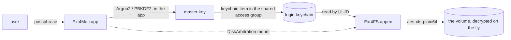

# Architecture

How the pieces fit, and the decisions that shaped them. What the driver will
and will not mount is [ENVELOPE.md](ENVELOPE.md); what works today is
[STATUS.md](STATUS.md).

```
Ext4Mac.app                          container app; macOS finds FSKit modules
│                                    through an installed application bundle
├── App/                             the menu-bar agent and the command line
│   ├── Ext4MacApp.swift             verbs: status, unlock, forget, last-error, …
│   ├── Ext4MenuBar.swift            DiskArbitration watcher; asks for passphrases
│   ├── Ext4Unlock.swift             derives a LUKS master key; keychain in, never out
│   ├── Ext4Notifier.swift           watches the events directory; notifications
│   └── Ext4Events.swift             reads what the extension wrote
├── Shared/                          compiled into both bundles
│   ├── LUKSKeychain.swift           the shared keychain group the key travels in
│   ├── VolumeEvent.swift            one thing that happened to one volume
│   └── VolumeEventStore.swift       atomic writes inside the sandbox, reads outside
└── Ext4FS.appex                     sandboxed FSKit extension
    ├── Ext4Extension.swift          @main, UnaryFileSystemExtension
    ├── Ext4FileSystem.swift         probe / load / unload; the feature gate; events
    ├── Ext4FileSystem+Maintenance   startFormat / startCheck
    ├── Ext4Volume.swift             identity, capabilities, attribute mapping
    ├── Ext4Volume+Operations        lookup, enumerate, attributes, symlinks, unmount
    ├── Ext4Volume+ReadWrite         all file I/O, xattrs
    ├── Ext4Volume+Preallocate       F_PREALLOCATE → unwritten extents
    ├── Ext4Volume+KernelIO.swift.disabled   extent maps for kernel-offloaded I/O (off)
    ├── Ext4Item.swift               an inode; explicitly NOT a path
    ├── Ext4Executor.swift           serial queue — lwext4 is not thread safe
    ├── Ext4LUKSKeys.swift           where a master key comes from
    ├── Ext4Log.swift                os_log, and the ring of core error lines
    ├── IdentityMapper.swift         Linux uid/gid ⇄ macOS presentation
    └── BlockDeviceBridge.swift      C callbacks → FSBlockDeviceResource,
        │                            with the cipher in the middle when needed
        └── libext4core.a
            ├── ext4_bridge.c        inode-oriented C API; probe; journal policy
            ├── crypto/              AES-XTS, LUKS1/2 headers, PBKDF2, Argon2
            └── lwext4               vendored, pinned submodule + patches/
```

## What happens on a mount

FSKit asks twice before anything is mounted, and once more that is easy to
mistake for a mount. Every one of these is a fresh extension process.

```mermaid
sequenceDiagram
    participant DA as DiskArbitration
    participant fskitd
    participant X as Ext4FS (a process per resource)
    participant App as Ext4Mac.app
    DA->>fskitd: disk attached
    fskitd->>X: probeResource
    X->>X: ext4b_probe: parse the superblock, apply the feature table
    alt not ext, not LUKS
        X-->>fskitd: notRecognized (and the resource is released)
    else refused / read-only / locked
        X->>App: VolumeEvent written to the extension's container
        X-->>fskitd: notRecognized, or usableButLimited
    else usable
        X-->>fskitd: usable(name, containerID)
    end
    fskitd->>X: loadResource (read-only) — the check pass
    X-->>fskitd: a volume that is never activated
    fskitd->>X: loadResource (read-write if the media allows)
    X->>X: open the device; LUKS layer if needed; replay the journal
    fskitd->>X: activate
    X->>App: degradedReadOnly, if it mounted read-only
    Note over DA,App: the volume is in Finder
```

Two things in that picture cost real time to learn. The read-only check
load never activates, so anything reported "at load" is reported for every
volume twice; the volume-event channel reports at `activate`. And a declined
resource keeps its device open for as long as the object lives, so the probe
drops its reference on decline or the disk cannot be ejected.

## How an encrypted volume opens

The extension cannot ask for a passphrase: it draws no UI, and FSKit has no
callback that delivers one. So the key has to be waiting before the mount.



The passphrase never enters the sandboxed process; the derivation, which
Argon2 prices at a gigabyte, happens in the app; and both sides address the
key by the container's LUKS UUID, so a key can only ever open the volume it
came from. When no key is stored, the extension records `locked`, the agent
sees the disk appear and asks; a stored key that no longer opens the
container is `keyRejected`, which is a different sentence to a person.

## Decisions that shaped this

### Inode-oriented, not path-oriented

lwext4's public API is path-based (`ext4_fopen("/a/b/c")`). FSKit is
inode-based: it asks "look up name N in directory D" and then hands the
resulting object back on every later call.

Bridging those by caching a path per item is the obvious approach and it is
wrong. A hard-linked inode has several equally valid paths, so any single
cached path is arbitrary; and renaming a directory silently invalidates the
cached path of every descendant. Both produce corruption that only shows up
later.

The bridge is therefore built on lwext4's inode-reference layer
(`ext4_fs_get_inode_ref`, `ext4_dir_find_entry`, `ext4_dir_iterator_*`), which
maps onto FSKit's model directly. `Ext4Item` stores an inode number and
nothing else.

### Callback-driven block I/O

`ext4b_device_create` takes read/write/flush function pointers rather than
calling FSKit itself. In the extension those land on `FSBlockDeviceResource`;
in the test suite they land on a plain file; in the fuzzer on a buffer.

This is why `make test` can exercise the real filesystem code with no code
signing, no entitlement, no mounting and no root — and why a contributor
without a paid Apple account can still work on the core.

### One I/O path, direct

Every read and write — metadata and file data alike — goes through
`FSBlockDeviceResource.read`/`write` on the raw descriptor FSKit hands the
extension. Two other paths exist in the API and neither runs here:

- **The metadata-cache family** (`metadataRead`, `delayedMetadataWrite`,
  `metadataFlush`) fails with `EIO` on this platform both before and after
  load. That family holds the only write barrier in the whole `FSResource`
  API, which is why this driver has none; the consequences are measured in
  [the notebook](notebook/write-ordering-and-the-barrier.md).
- **Kernel-offloaded I/O** (`FSVolumeKernelOffloadedIOOperations`, where
  `blockmapFile` hands the kernel an extent map and it moves the bytes) is
  implemented and held out of the build. Conforming makes FSKit route writes
  through `blockmapFile` even for files that report `inhibitKernelOffloadedIO`,
  and a write blockmap must allocate and journal before it knows whether the
  I/O will succeed, with nothing to undo it. Allocation stays inside a
  transaction we control instead. `Ext4Volume+KernelIO.swift.disabled`.

Direct I/O is also what makes the LUKS layer possible: the cipher sits
between the callbacks and the resource, and nothing above it sees an
encrypted byte.

### Serialisation

FSKit issues volume operations concurrently. lwext4 keeps global mount-point
state and its block cache has no locking, so every call into the core funnels
through `Ext4Executor`'s serial queue. This is a correctness requirement, not a
tuning knob, and the boundary is easy to leak across by accident: attribute
translation looks like pure data-shuffling, but resolving `parentID` reads the
directory's `..` entry, so it is a core call too. Doing it just outside the
executor block was enough to let two kernel threads into lwext4 at once, which
double-freed a block-cache buffer and hung the volume. `Ext4Volume.populate`
documents that it must run on the executor, and the unmount path counts
concurrent entries and reports any it saw.

`volumeStatistics` is the single deliberate exception. FSKit declares it
synchronous, so there is nowhere to await, and blocking a kernel thread on the
executor would deadlock whenever the executor was busy. It is safe only because
`ext4_mount_point_stats` reads fields out of the in-memory superblock and
touches neither the cache nor the device.

Serialisation is not the same as liveness. FSKit delivers operations after the
volume has been closed — `synchronize` reliably arrives after `unmount` — so
the core handle has to be fallible rather than force-unwrapped.

### The feature gate

`ext4b_probe()` parses the superblock by hand — no mounting, no writes, full
bounds checking on every geometry field — and gates on an **allow-list**. An
unknown INCOMPAT bit means the on-disk layout may differ in ways we cannot
see, so the volume is refused rather than risked; an unknown RO_COMPAT bit
is safe to read and not to write, so it mounts read-only.

The gate is a table, not a chain of conditions: one row per feature bit with
its policy (supported, read-only, refused) and the sentence a person sees.
`ext4dump policy` prints it, and [ENVELOPE.md](ENVELOPE.md) carries the same
table for readers — `Tests/run_envelope_tests.sh` diffs the two, so the
document cannot quietly stop describing the code.

The geometry checks around the table are where the fuzzer's findings land:
an inode size that does not fit its block, a group count the inodes cannot
cover, a descriptor size that is not a power of two. Each was a heap
overflow somewhere in lwext4 before it was a row in the probe, and the probe
refuses before any of that code runs.

One case is worth calling out. `metadata_csum_seed` (INCOMPAT 0x2000) stores
an explicit checksum seed so `tune2fs` can change a volume's UUID without
rewriting every checksum. Upstream lwext4 has no notion of that field and
always derives the seed from the UUID, so on any volume whose UUID had ever
changed every checksum it wrote was wrong. `patches/lwext4/0012` gives it
`ext4_sb_csum_seed()`, which honours the stored value, and such volumes mount
read-write here. Modern `mke2fs` enables the feature by default.

### What the extension says when it cannot mount

FSKit's whole failure vocabulary reaches the user as one sentence — "The
disk you inserted was not readable by this computer" — whether the volume
uses a feature this driver refuses, is damaged, is locked, or mounted
read-only. The extension has no window and no notification. So it writes a
`VolumeEvent` (kind, reason, the probe verdict, the last error lines from the
core, the build id) into its own container, atomically, and the app reads it
from outside: `Ext4Mac last-error`, `Ext4Mac status`, and a directory watch
that raises a notification. No IPC, deliberately — a file the extension can
always write and the app can always read is the same channel the LUKS key
store proved.

### Ownership mapping

ext4 records Linux uid/gid values that mean nothing locally: a disk from a
Linux box is typically owned by uid 1000, which is not the Mac user, so Finder
would refuse nearly every operation.

The default follows Apple's own msdos/exfat behaviour and presents everything
as owned by the mounting user. On-disk uid/gid are preserved and written back
unchanged, so a volume that round-trips through macOS still looks right on
Linux.
